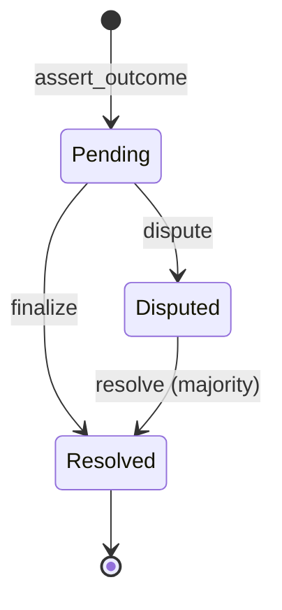

# Tholos

[](https://github.com/drydocs/tholos/actions/workflows/ci.yml)
[](https://drydocs.github.io/tholos/)
[](LICENSE)

Bonded assertion and dispute oracle for resolving real world outcomes. Resolution infra for prediction markets and anything else that needs a trustworthy yes/no.

Docs: [drydocs.github.io/tholos](https://drydocs.github.io/tholos/)

## Status

The assertion and dispute contract (`contracts/tholos`) is implemented, tested, and has been deployed and exercised on Stellar testnet.

- Core propose/dispute/resolve flow: done
- Admin-controlled resolver committee updates: done
- Pause / emergency-stop: done
- Reentrancy hardening (state written before external token transfers): done
- CI (fmt, clippy, tests, wasm build): done
- Fee-funded reward for uncontested finalizes: not yet (no fee-generating market layer exists to fund it)

See [CONTRACT.md](docs/src/CONTRACT.md) for the full interface and known gaps,
[ARCHITECTURE.md](docs/src/ARCHITECTURE.md) for design rationale, or
[INTEGRATION.md](docs/src/INTEGRATION.md) if you're building a contract that wants
to call into Tholos. Deploying your own instance: see
[DEPLOYMENT.md](docs/src/DEPLOYMENT.md). New to the terminology: see
[GLOSSARY.md](docs/src/GLOSSARY.md).

## Why

Prediction markets and similar products eventually need to answer a hard question: who decides what actually happened? Existing approaches either rely on token holder votes that can be captured by large holders with a stake in the outcome, or on a centralized, regulated party acting as sole resolver.

Tholos is a bonded assertion and dispute contract: anyone can propose an outcome by posting a bond, and a challenge window gives others the chance to dispute it before it finalizes. It is designed to be standalone and composable, so any contract that needs a trustworthy resolution of a real world event can plug into it rather than building its own oracle logic.

## How it works



A bond gets posted, a window gives anyone the chance to dispute it, and if disputed, a resolver committee votes to decide who was right. See [CONTRACT.md](docs/src/CONTRACT.md) for the function reference and events, or [ARCHITECTURE.md](docs/src/ARCHITECTURE.md) for sequence diagrams of each flow.

## Tech stack

| Layer | Technology |
| --- | --- |
| Contract | Rust, [Soroban SDK](https://developers.stellar.org/docs/build/smart-contracts/overview) 26 |
| Network | Stellar (testnet today) |
| Token | Any SEP-41 / Stellar Asset Contract token, configured per deployment |
| CI | GitHub Actions: `cargo fmt`, `shellcheck`, `cargo clippy`, `cargo test`, wasm build |

## Project layout

```text
contracts/
  tholos/               The assertion and dispute contract
  demo-consumer/        Minimal example contract that calls into Tholos,
                         validating the pattern documented in INTEGRATION.md
scripts/
  testnet-smoke.sh      End-to-end check against real Stellar testnet infrastructure
.github/workflows/
  ci.yml                 Runs fmt, clippy, tests, and the wasm build on every push/PR
```

## Development

Requires the Rust toolchain with the `wasm32v1-none` target, plus the [Stellar CLI](https://developers.stellar.org/docs/tools/cli/install-cli) for building and deploying the contract.

You can use the Makefile shortcut:

```sh
# Build tholos's wasm first (required by workspace)
make build-wasm

# Run unit tests
make test

# Check formatting and lints
make check

# Build the optimized, deployable contract wasm
make build-optimized
```

Or run the raw commands directly:

```sh
# Build tholos's wasm first: demo-consumer imports it at compile time, so this
# has to exist before anything below touches the rest of the workspace.
cargo build -p tholos --target wasm32v1-none --release

# Run unit tests
cargo test

# Check formatting and lints (same checks CI runs)
cargo fmt --check
shellcheck scripts/*.sh
cargo clippy --workspace --all-targets -- -D warnings

# Build the optimized, deployable contract wasm
cd contracts/tholos && stellar contract build
```

To exercise a fresh deploy end-to-end against Stellar testnet (deploy, initialize, assert, dispute, resolve):

```sh
bash scripts/testnet-smoke.sh
```

See [CONTRIBUTING.md](CONTRIBUTING.md) for contribution guidelines.

## License

[MIT](LICENSE)
