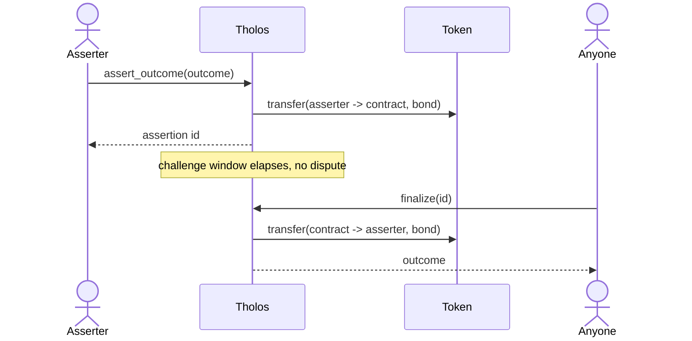
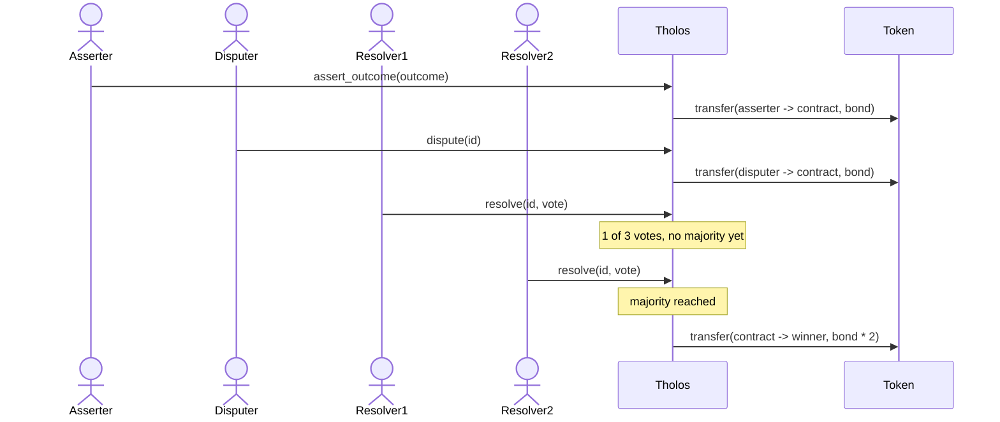
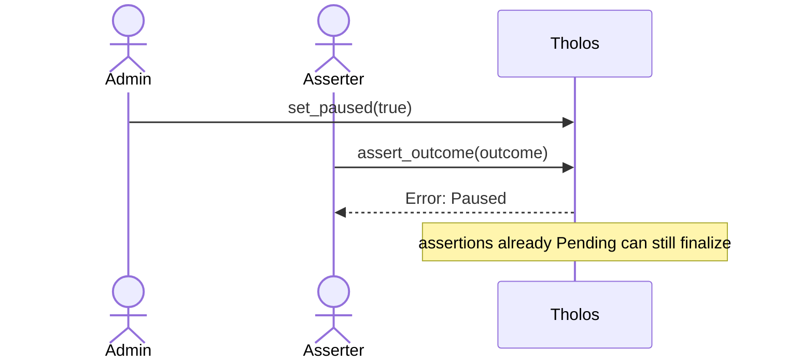

# Architecture

This covers *why* Tholos is built the way it is. For *what* each function does,
see [CONTRACT.md](CONTRACT.md).

## One instance, one configuration

A Tholos deployment is initialized once with a single token, bond amount,
challenge window, and resolver committee. There's no per-call override. This is a
deliberate simplicity tradeoff for v1: it means every assertion posted to a given
instance is directly comparable (same collateral, same window), and it keeps the
storage model and auth model simple. The cost is that markets wanting different
bond sizes need separate instances; see [INTEGRATION.md](INTEGRATION.md) for how
callers are expected to handle that.

## Odd-length resolver committee, simple majority

`resolvers` must have an odd, non-zero length, enforced in both `initialize` and
`update_resolvers`. This is the whole tie-breaking mechanism: with an odd
committee, a strict majority (`len / 2 + 1`) is always reachable and never
ambiguous. No tie-handling logic exists because none is needed.

## Challenge window is capped at 7 days

`initialize` rejects any `challenge_window_secs` over 7 days, not just zero. This
isn't arbitrary: persistent `Assertion` storage gets a 30-day TTL bump on every
write (see "Persistent storage TTL" in [CONTRACT.md](CONTRACT.md)), and a window
close to that 30-day ceiling would leave little to no time after the window closes
for `finalize` to actually be called, or for a dispute opened right before the
window closes to get resolved, before the entry risks archival. 7 days keeps a
wide margin. Bond amount deliberately has no upper bound: unlike the window, there
is no protocol-level quantity to cap it against, since a "sane" bond ceiling
depends on the configured token's decimals and intended use, which the contract
has no way to judge. That's left to whoever configures a deployment.

## Resolver committee is snapshotted per dispute

`dispute` copies the current resolver committee onto the assertion
(`Assertion.resolvers`); `resolve` checks membership and computes majority against
that snapshot, not the live `Resolvers` value in contract storage. Earlier this
wasn't snapshotted: `resolve` re-read the live committee on every call. That meant
an `update_resolvers` call in the middle of an open dispute could change who was
entitled to decide it and what majority meant, mid-vote, which is a correctness
problem independent of whether the update was legitimate or malicious. Snapshotting
at `dispute` time makes a dispute's rules fixed for its whole lifetime: whoever was
on the committee when it opened decides it, regardless of what the committee looks
like by the time it closes.

## State before external calls

Every function that moves tokens (`assert_outcome`, `dispute`, `finalize`,
`resolve`) writes its state change to storage *before* calling the token
contract's `transfer`. This wasn't the original implementation; an internal
security review found that writing state *after* the transfer left a reentrancy
window. Because Soroban cross-contract calls are synchronous, a non-standard or
malicious token could call back into Tholos mid-transfer and see stale state (an
assertion still `Pending` when it was actually already being finalized),
allowing a second payout drawn from bonds belonging to unrelated assertions in
the same pooled contract balance. The fix, and a regression test that exercises
it directly against a token built to attempt exactly that reentrant call, are in
`contracts/tholos/src/lib.rs` and `contracts/tholos/src/test.rs::test_finalize_is_not_reentrant`.
See the "Security notes" section of [CONTRACT.md](CONTRACT.md) for the interface-level
summary.

## Pause is scoped, not absolute

`set_paused` blocks `assert_outcome`, `dispute`, and `resolve`, but deliberately
*not* `finalize` or `update_resolvers`. The reasoning: a pause exists to stop new
exposure (new bonds, new disputes, new votes) while an incident is investigated,
not to freeze funds that are already committed. An assertion that was `Pending`
before the pause and never gets disputed shouldn't be stuck waiting on the
incident to resolve; letting `finalize` run means its bond returns normally.
Similarly, if the pause was triggered *because* the resolver committee is
compromised, the admin needs `update_resolvers` to actually fix that while
paused, not after unpausing.

## Flows

### Uncontested: assert, then finalize

### Contested: assert, dispute, resolve

### Paused: new assertions rejected, existing ones unaffected

