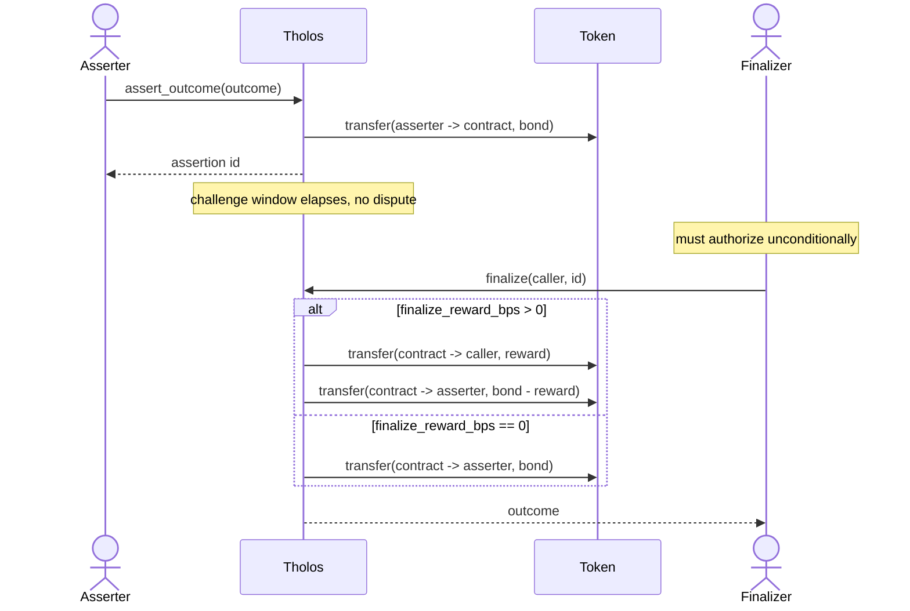
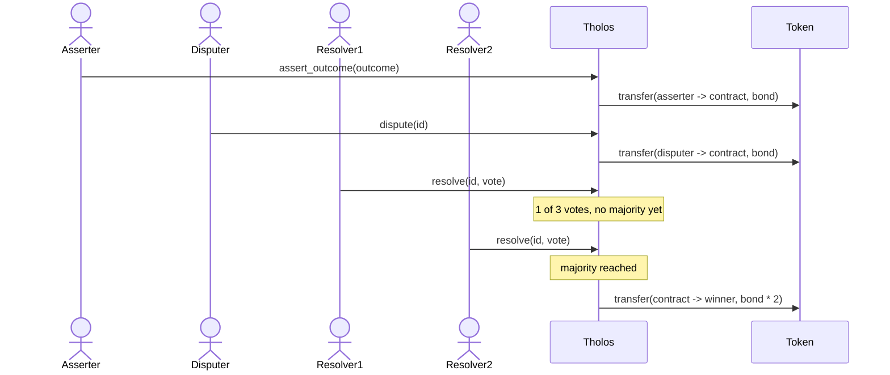

# Architecture

This covers *why* Tholos is built the way it is. For *what* each function does,
see [CONTRACT.md](CONTRACT.md).

The committee described here is the implemented protocol v1 mechanism. A
stake-weighted, dispute-scoped replacement is under design for protocol v2; see
[V2_RESOLUTION.md](V2_RESOLUTION.md). That proposal does not describe current
contract behavior.

## One instance, one configuration

A Tholos deployment is initialized once with a single token, bond amount,
challenge window, and resolver committee. There's no per-call override. This is a
deliberate simplicity tradeoff for v1: it means every assertion posted to a given
instance is directly comparable (same collateral, same window), and it keeps the
storage model and auth model simple. The cost is that markets wanting different
bond sizes need separate instances; see [INTEGRATION.md](INTEGRATION.md) for how
callers are expected to handle that.

## Odd-length resolver committee, simple majority

`resolvers` must be non-empty, have an odd number of members, contain distinct
addresses, and have no more than `MAX_RESOLVERS` (21) members. Both `initialize`
and `update_resolvers` enforce these constraints; duplicate addresses fail with
`DuplicateResolvers`. An odd committee makes the strict-majority threshold
(`len / 2 + 1`) unambiguous and eliminates an arithmetic tie. No separate
tie-handling or timeout logic exists.

## Challenge window is capped at 7 days

`initialize` rejects any `challenge_window_secs` over 7 days, not just zero. This
isn't arbitrary: persistent `Assertion` storage gets a 30-day TTL bump on every
write (see "Persistent storage TTL" in [CONTRACT.md](CONTRACT.md)), and a window
close to that 30-day ceiling would leave little to no time after the window closes
for `finalize` to actually be called, or for a dispute opened right before the
window closes to get resolved, before the entry risks archival. 7 days keeps a
wide margin. Bond amount deliberately has no economic upper bound: a sensible
ceiling depends on the configured token's decimals and intended use, which the
contract cannot judge. There is still an arithmetic limit: `initialize` enforces
`MAX_BOND_AMOUNT`, the largest bond that cannot overflow `finalize`'s
reward-multiply arithmetic or the token balance held across a dispute.

## Resolver committee is snapshotted per dispute

`dispute` copies the current resolver committee onto the assertion
(`Assertion.resolvers`); `resolve` checks membership and computes majority against
that snapshot, not the live `Resolvers` value in contract storage. Earlier this
wasn't snapshotted: `resolve` re-read the live committee on every call. That meant
an `update_resolvers` call in the middle of an open dispute could change who was
entitled to decide it and what majority meant, mid-vote, which is a correctness
problem independent of whether the update was legitimate or malicious. Snapshotting
at `dispute` time makes a dispute's rules fixed for its whole lifetime: whoever was
on the committee when it opened decides it, regardless of what the committee looks
like by the time it closes.

The v2 proposal preserves this immutability rather than the committee itself. It
pins resolution policy when an assertion opens, then freezes dispute-specific
bond positions and their aggregate weight before discretionary third-party
choices are revealed.

## State before external calls

Every function that moves tokens (`assert_outcome`, `dispute`, `finalize`,
`resolve`) writes its state change to storage *before* calling the token
contract's `transfer`. This wasn't the original implementation; an internal
security review found that writing state *after* the transfer left a reentrancy
window. Because Soroban cross-contract calls are synchronous, a non-standard or
malicious token could call back into Tholos mid-transfer and see stale state (an
assertion still `Pending` when it was actually already being finalized),
allowing a second payout drawn from bonds belonging to unrelated assertions in
the same pooled contract balance. The fix is in `contracts/tholos/src/lib.rs`, with
a `test_*_is_not_reentrant` regression test per function in
`contracts/tholos/src/test.rs`, each built against a token that attempts exactly
that reentrant call. See the "Security notes" section of [CONTRACT.md](CONTRACT.md)
for the interface-level summary. All four functions require auth (`finalize`
unconditionally), so Soroban's auth model independently rejects a reentrant
token's nested `require_auth` for all of them; the state-before-transfer ordering
is a second layer of defense in case a colluding, pre-authorized signer ever got
one through.

## Pause is scoped, not absolute

`set_paused` blocks `assert_outcome`, `dispute`, and `resolve`, but deliberately
*not* `finalize` or `update_resolvers`. The intended scope is incident containment:
stop new bonds, disputes, and votes while still allowing an uncontested pending
assertion to return its bond through `finalize`. This is not funds-neutral. Open
disputes cannot progress while paused, and a pending assertion also cannot be
challenged even though its deadline continues and `finalize` remains available.
Pause must therefore be short-lived and is not a safe retirement switch.

If the pause was triggered because the live resolver committee is compromised,
the admin can use `update_resolvers` while paused to protect disputes opened after
the update. It cannot repair an already open dispute: that assertion keeps its
snapshotted committee, including a compromised or unavailable member.

## Finalize reward is bond-funded, not externally funded

The original design anticipated a reward for prompt finalization paid from market
fees. No fee-generating market layer exists yet, so the reward is instead taken
from the asserter's bond: `finalize_reward_bps` (0–1000 basis points) is set at
`initialize` time and determines what fraction of the bond the caller of `finalize`
receives. This keeps the mechanism self-contained — no external funding source is
required — while still creating an economic incentive. The asserter implicitly
accepts the haircut when they post; they control which deployment they post to, and
deployments with higher reward bps expose more of the bond.

Setting `finalize_reward_bps` to 0 (the default) reproduces the original behavior
exactly: no reward is taken, the full bond is returned to the asserter. Auth is
still required unconditionally: without it, any address could be passed as `caller`
with no verification, and that address would be permanently written into
`Assertion.finalizer` and the `Finalized` event as the finalizer of record — a
spoofable audit trail, even though no funds are at risk. Requiring auth keeps that
record trustworthy regardless of reward configuration. A non-zero value additionally
means the caller receives a fraction of the bond as an incentive. Soroban's auth
model independently rejects a reentrant token's nested `require_auth` in both cases,
so the reentrancy threat model for `finalize` is the same as for the other three
functions regardless of the reward setting.

## Flows

### Uncontested: assert, then finalize (with optional reward)



### Contested: assert, dispute, resolve



### Paused: selected state changes blocked

```mermaid
sequenceDiagram
    actor Admin
    actor Asserter
    participant Tholos

    Admin->>Tholos: set_paused(true)
    Asserter->>Tholos: assert_outcome(outcome)
    Tholos-->>Asserter: Error: Paused
    Note over Tholos: Pending can finalize but cannot be disputed;<br/>Disputed cannot receive votes
```
