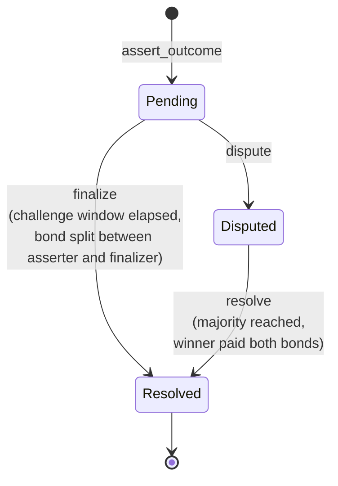

# Contract interface

Reference for `contracts/tholos`. Source of truth is `contracts/tholos/src/lib.rs`; this
document should be updated alongside any change to the public interface.

## Lifecycle



Every assertion ends in `Resolved`, reached one of two ways: uncontested (`finalize`
after the challenge window with no dispute) or contested (`resolve` once a majority
of the resolver committee agrees on one side).

## Types

### `Status`

State of an assertion: `Pending`, `Disputed`, or `Resolved`.

### `Assertion`

| Field | Type | Meaning |
| --- | --- | --- |
| `asserter` | `Address` | Who posted the claim |
| `outcome` | `bool` | The claimed outcome |
| `bond` | `i128` | Bond amount posted (in the configured token) |
| `opened_at` | `u64` | Ledger timestamp the assertion was posted |
| `status` | `Status` | Current state |
| `disputer` | `Option<Address>` | Who disputed it, if disputed |
| `votes_for_outcome` / `votes_against_outcome` | `u32` | Resolver vote tally |
| `voted` | `Vec<Address>` | Resolvers who have already voted, to prevent double-voting |
| `resolvers` | `Vec<Address>` | The resolver committee snapshotted at dispute time; empty until `dispute` is called. See `resolve` below. |
| `finalizer` | `Option<Address>` | Who called `finalize`, if the assertion was finalized (not resolved via `resolve`). `None` until `finalize` is called; always `Some(caller)` after — the caller must authorize unconditionally, so this is always a verified address once set. |

### `Error`

| Variant | Meaning |
| --- | --- |
| `AlreadyInitialized` | `initialize` called on a contract that's already set up |
| `NotInitialized` | Called before `initialize` (e.g. `update_resolvers`) |
| `InvalidResolverCount` | Resolver list is empty or has an even length |
| `AssertionNotFound` | No assertion exists with the given id |
| `NotPending` | Action requires `Status::Pending` but the assertion isn't |
| `NotDisputed` | Action requires `Status::Disputed` but the assertion isn't |
| `ChallengeWindowClosed` | Tried to dispute after the challenge window elapsed |
| `ChallengeWindowOpen` | Tried to finalize before the challenge window elapsed |
| `NotAResolver` | Caller isn't in the current resolver committee |
| `AlreadyVoted` | Resolver already voted on this assertion |
| `Paused` | Called `assert_outcome`, `dispute`, or `resolve` while paused |
| `InvalidBondAmount` | `bond_amount` is zero, negative, or greater than `MAX_BOND_AMOUNT` |
| `InvalidChallengeWindow` | `challenge_window_secs` is zero or greater than 7 days |
| `TooManyResolvers` | Resolver list has more than `MAX_RESOLVERS` (21) entries |
| `InvalidFinalizeReward` | `finalize_reward_bps` is greater than `MAX_FINALIZE_REWARD_BPS` (1000) |
| `DuplicateResolvers` | Resolver list contains the same address more than once |

## Functions

### `initialize(admin, token, bond_amount, challenge_window_secs, resolvers, finalize_reward_bps)`

One-time setup. `resolvers` must have an odd, non-zero length, and at most
`MAX_RESOLVERS` (21), so a majority vote can never tie and no single dispute
snapshot grows unbounded. `bond_amount` must be positive and no greater than
`MAX_BOND_AMOUNT` — the largest bond that can't overflow the token balance or
`finalize`'s reward-multiply arithmetic — and `challenge_window_secs`
must be non-zero and at most 7 days (see "Persistent storage TTL" below for why).
`finalize_reward_bps` sets the fraction of the bond (in basis points, 0–1000) paid
to whoever calls `finalize` as an incentive for prompt finalization; 0 disables the
reward entirely and the full bond is returned to the asserter.
Requires `admin`'s signature. Fails with `AlreadyInitialized` if called twice.

### `update_resolvers(new_resolvers)`

Replaces the resolver committee used for assertions disputed *after* this call.
Requires the stored admin's signature. Same odd-length and `MAX_RESOLVERS` cap as
`initialize`. Emits `ResolversUpdated`. Has no effect on assertions already
`Disputed`: each dispute snapshots the committee at the moment `dispute` is called (see the
`resolvers` field on `Assertion`), and voting for that dispute is decided against
that snapshot for its whole lifetime, not the live committee. A resolver removed
after a dispute was opened can still vote on it; a resolver added after can't.

### `set_paused(paused)`

Pauses or unpauses `assert_outcome`, `dispute`, and `resolve`. Requires the stored
admin's signature. `finalize` is deliberately exempt: assertions already `Pending`
before a pause can still be finalized while paused, so an uncontested claim isn't
stuck waiting on an unpause. `update_resolvers` is also exempt, so a compromised
committee can be replaced without unpausing first. Emits `PauseUpdated`.

### `assert_outcome(asserter, outcome) -> u64`

Posts a bonded claim. Transfers `bond_amount` from `asserter` to the contract.
Requires `asserter`'s signature. Fails with `Paused` if paused. Returns the new
assertion id. Emits `Asserted`.

### `dispute(disputer, id)`

Disputes a `Pending` assertion within the challenge window, matching its bond.
Requires `disputer`'s signature. Fails with `Paused` if paused, `NotPending` if the
assertion isn't pending (including if it's already disputed), or
`ChallengeWindowClosed` if the window has elapsed. Emits `Disputed`.

### `finalize(caller, id) -> bool`

Callable once a `Pending` assertion's challenge window has elapsed with no dispute.
`caller` must authorize the call unconditionally — regardless of whether
`finalize_reward_bps` is zero — so the address recorded in `Assertion.finalizer`
and the `Finalized` event is always a verified caller and cannot be spoofed. This
applies even when no reward is being paid: without enforced auth, any address could
be passed as `caller`, permanently writing an unverifiable identity into the
on-chain record.

- When `finalize_reward_bps` is **non-zero**, `caller` also receives
  `bond * finalize_reward_bps / 10_000` tokens as an incentive for prompt
  finalization; the asserter receives the remainder.
- When `finalize_reward_bps` is **zero** (the default), no reward is paid and the
  full bond is returned to the asserter. Auth is still required.

In both cases `Assertion.finalizer` is set to `Some(caller)`.

Returns the asserted outcome. Fails with `ChallengeWindowOpen` if called too early. Emits `Finalized` with `finalizer` (`Address`) and `reward` fields.

### `resolve(resolver, id, agrees_with_asserter) -> Option<bool>`

Casts one resolver's vote on a `Disputed` assertion. Requires `resolver`'s signature
and that they're in the committee snapshotted when this assertion was disputed
(`Assertion.resolvers`), not necessarily the live committee. Fails with `Paused` if
paused, `NotAResolver`, `NotDisputed`, or `AlreadyVoted` as appropriate.

Returns `None` if no side has reached a strict majority yet. Once a majority agrees,
the winning side (asserter if the majority agreed with them, disputer otherwise)
receives both bonds, the assertion moves to `Resolved`, a `Resolved` event is
emitted, and the function returns `Some(final_outcome)`.

### `get_assertion_state(id) -> Assertion`

Read-only lookup. Fails with `AssertionNotFound` if the id doesn't exist.

## Security notes

`assert_outcome`, `dispute`, `finalize`, and `resolve` each write their state
change (new assertion, status transition, vote tally) to storage *before* calling
the external token contract's `transfer`. This follows checks-effects-interactions
deliberately: cross-contract calls in Soroban are synchronous, so a non-standard
or malicious `token` contract could otherwise call back into Tholos mid-transfer
and observe stale state (e.g. an assertion still `Pending` when it's actually
already being finalized), enabling a double payout drawn from the pooled bonds of
unrelated assertions. All four functions have a regression test in
`contracts/tholos/src/test.rs` (`test_*_is_not_reentrant`) that exercises this
directly against a token built to attempt exactly that reentrant call.

`finalize` requires `caller.require_auth()` unconditionally — regardless of whether
`finalize_reward_bps` is zero. Without this, a zero-bps deployment would accept any
address as `caller` with no authorization, permanently writing an unverifiable
identity into `Assertion.finalizer` and the `Finalized` event as the "finalizer of
record." No funds are at risk (the caller only ever receives its own reward), but the
audit trail would be spoofable. Requiring auth unconditionally ensures the recorded
finalizer is always a verified address. Soroban's auth model also independently
rejects a reentrant token's nested `require_auth`, giving `finalize` the same
first-layer reentrancy protection as `assert_outcome`, `dispute`, and `resolve`.
The state-before-transfer ordering is a second layer of defense in both cases.

### Persistent storage TTL

Every write to an assertion's persistent storage entry (in `assert_outcome`,
`dispute`, `finalize`, and `resolve`) extends its TTL by 30 days
(`ASSERTION_BUMP_AMOUNT`), via the shared `set_assertion` helper. This is why
`challenge_window_secs` is capped at 7 days: it leaves comfortable headroom within
that 30-day bump for the window to elapse and for `finalize`, `dispute`, or a
resolver's `resolve` to actually be called afterward, without the ledger entry
being archived first. `contracts/tholos/src/test.rs::test_assertion_storage_ttl_is_extended_on_every_write`
verifies the TTL is actually extended on write, not just claimed in a comment.

## Events

Each state-changing function emits a corresponding event, topic-indexed by
assertion `id` where applicable, so off-chain indexers can follow an assertion's
history without polling `get_assertion_state`:

| Event | Emitted by | Fields |
| --- | --- | --- |
| `Asserted` | `assert_outcome` | `id`, `asserter`, `outcome` |
| `Disputed` | `dispute` | `id`, `disputer` |
| `Finalized` | `finalize` | `id`, `outcome`, `finalizer` (`Address`), `reward` |
| `Resolved` | `resolve`, once a majority is reached | `id`, `outcome` |
| `ResolversUpdated` | `update_resolvers` | `resolvers` (the new committee) |
| `PauseUpdated` | `set_paused` | `paused` |

`Finalized.finalizer` is always the address that called `finalize` — auth is required unconditionally, so this value is always verified regardless of whether `finalize_reward_bps` is non-zero. `Finalized.reward` is the number of tokens paid to that address (0 when `finalize_reward_bps` is 0).

## Example: calling it with the Stellar CLI

Deploy, initialize with a 3-member resolver committee and a 1 % finalize reward,
and post an assertion (the same flow `scripts/testnet-smoke.sh` automates):

```sh
CONTRACT=$(stellar contract deploy --wasm target/wasm32v1-none/release/tholos.wasm \
  --source deployer --network testnet)

stellar contract invoke --id "$CONTRACT" --source deployer --network testnet -- initialize \
  --admin "$DEPLOYER_ADDRESS" \
  --token "$TOKEN_CONTRACT_ID" \
  --bond_amount 1000000 \
  --challenge_window_secs 3600 \
  --resolvers "[\"$R1\",\"$R2\",\"$R3\"]" \
  --finalize_reward_bps 100

stellar contract invoke --id "$CONTRACT" --source asserter --network testnet -- assert_outcome \
  --asserter "$ASSERTER_ADDRESS" \
  --outcome true

# After the challenge window elapses.
# Auth is required unconditionally: pass the caller's address and sign.
stellar contract invoke --id "$CONTRACT" --source finalizer --network testnet -- finalize \
  --caller "$FINALIZER_ADDRESS" \
  --id 0
```

See `scripts/testnet-smoke.sh` for the full round trip including dispute and
resolve.

## Known gaps

- `set_paused` and `update_resolvers` are both single-admin-key operations, which is a bigger centralization
  point than the resolver committee itself. A resolver self-rotation scheme (the
  committee votes to replace one of its own) was considered but not built for v1.
